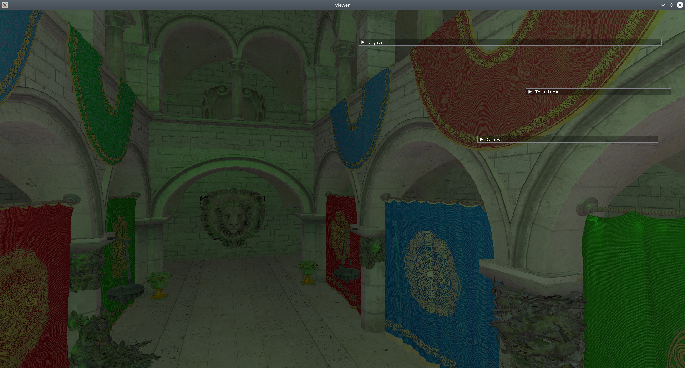

# Innsmouth - Library for experiments with Vulkan

### Examples:

### Third Party 

1. [Dear ImGui](https://github.com/ocornut/imgui) for UI
2. [tinyobjloader](https://github.com/tinyobjloader/tinyobjloader) for OBJ files loading
3. [STB](https://github.com/nothings/stb) for image processing
4. [GLM](https://github.com/g-truc/glm) for 3D mathematics 
5. [SPIRV-Reflect](https://github.com/KhronosGroup/SPIRV-Reflect) for shader introspection
6. [volk](https://github.com/zeux/volk) for Vulkan API loading